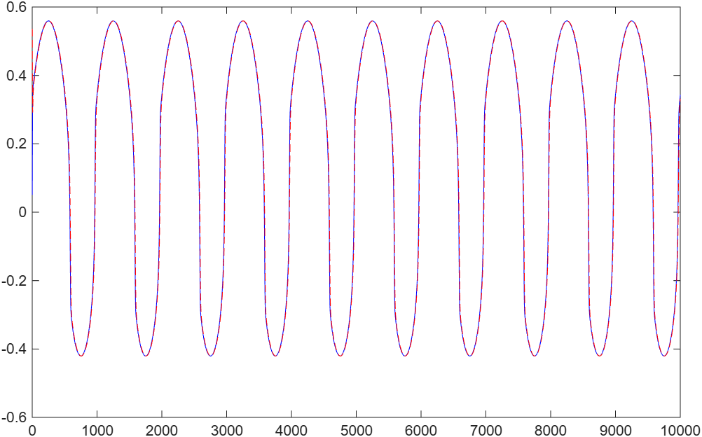
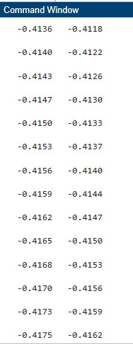
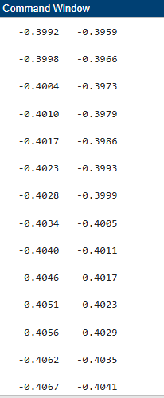
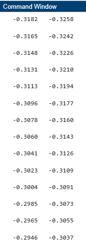
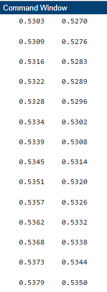
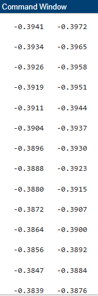
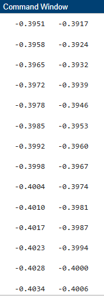

# Neural Network System Identification using MATLAB

A MATLAB implementation of a Feedforward Neural Network (FNN) for nonlinear system identification.

---

## 📖 Overview

This project presents the implementation of a **Feedforward Neural Network (FNN)** to identify the behavior of a nonlinear dynamic system.

The model was developed in **MATLAB** and trained to predict the system output. The predicted output (**Ynn**) is compared with the actual plant output (**Yp**) to evaluate the network performance.

---

## 🎯 Objectives

- Design and implement a Feedforward Neural Network (FNN).
- Predict the output of a nonlinear dynamic system.
- Compare the predicted output (**Ynn**) with the actual output (**Yp**).
- Evaluate the network performance using graphical results.

---

## 🛠️ Software Used

- MATLAB
- Feedforward Neural Network (FNN)

---

## 📂 Repository Structure

```text
Neural-Network-System-Identification/
│
├── MATLAB_Code_FNN/
│
├── Problem_Statement/
│
├── Results/
│   ├── Plot.png
│   ├── R1.PNG
│   ├── R2.PNG
│   ├── R3.PNG
│   ├── R4.PNG
│   ├── R5.PNG
│   └── R6.PNG
│
└── README.md
```

---

## 📊 Results

### Overall System Response




---

### Comparison Between **Ynn** and **Yp**

#### Part 1



#### Part 2



#### Part 3



#### Part 4



#### Part 5



#### Part 6



---

## 💡 Skills Demonstrated

- MATLAB Programming
- Feedforward Neural Networks
- Nonlinear System Identification
- Data Analysis
- Scientific Visualization
- Performance Evaluation

---

## 👩‍💻 Author

**Habiba Moharm**

Mechatronics & Robotics Engineering Student
